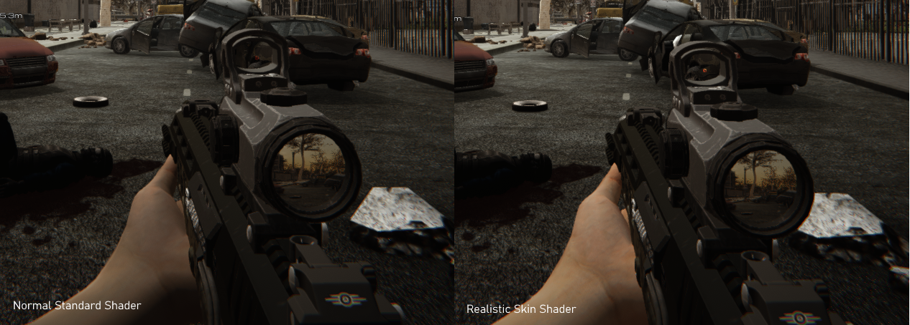

# Realistic Skin Shader for Unity

This repository contains an advanced realistic skin shader for Unity. It's designed to achieve a high level of realism in rendering skin materials. The shader is written in CG within Unity's ShaderLab framework and is based on the Lambertian lighting model.

## Features

- **Diffuse Texturing**: Use high-quality skin textures for detailed rendering.
- **Normal Mapping**: For realistic surface details.
- **Specular Reflections**: Specular highlights with control over the glossiness.
- **Subsurface Scattering**: Approximates the effect of light penetrating the skin surface.
- **Fresnel Effect**: Implements Fresnel falloff to simulate the varying reflectivity at different angles.
- **Customization**: Easily tweakable properties for subsurface scattering, specular gloss, and more.

## Getting Started

### Prerequisites

- Unity 2018.1 or newer

### How to Use

1. In Unity, create a new material (Right-click in Assets > Create > Material).
2. Assign the shader to the material by selecting the material, and in the Inspector, go to Shader, and select Custom > RealisticSkin.
3. Assign the material to a GameObject with a Mesh Renderer.
4. In the material's properties, you can assign textures and tweak the parameters for subsurface scattering, specular gloss, etc.

## Parameters

- **Albedo (RGB)**: The basic texture of the skin.
- **Normal Map**: The normal map for surface details.
- **Specular Map**: Defines the specular reflections of the surface.
- **Subsurface Color**: Color of the subsurface scattering effect.
- **Subsurface Strength**: Strength of the subsurface scattering effect.
- **Specular Gloss**: Controls the glossiness of specular reflections.
- **Fresnel Falloff**: Controls the falloff of the Fresnel effect.

## Contributing

Contributions are welcome! If you would like to improve the shader, please fork the repository and submit a pull request.

## License

This project is licensed under the MIT License - see the [LICENSE](LICENSE) file for details.
